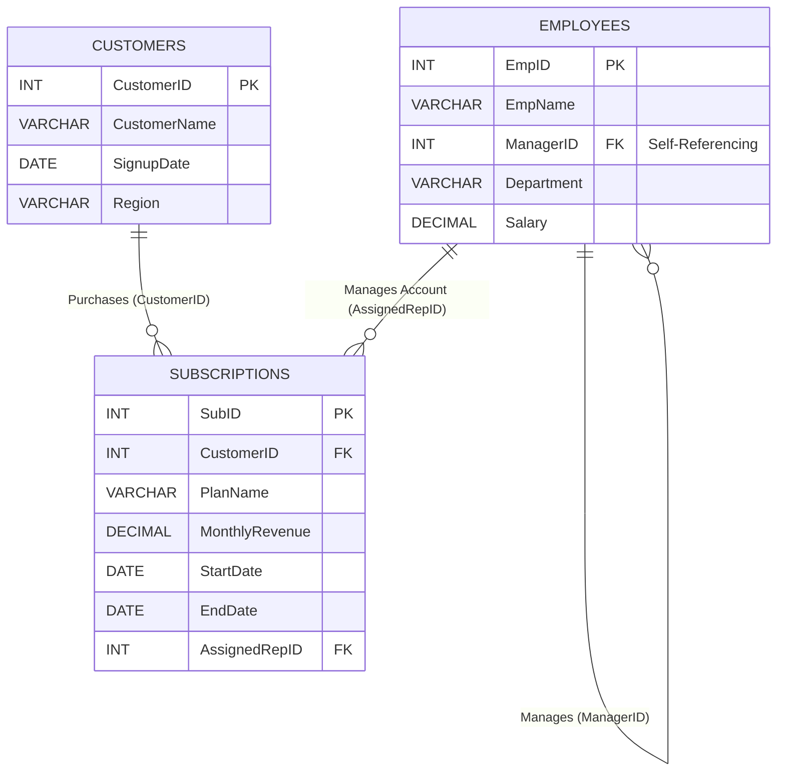

# Operations Revenue Analysis

Advanced T-SQL capstone focused on SaaS operations and recurring revenue analytics.

## Why This Project Matters
- Converts raw subscription history into decision-ready revenue signals.
- Demonstrates practical SQL problem-solving across hierarchy traversal, lifecycle analytics, and trend tracking.
- Mirrors real SaaS reporting needs: retention visibility, rep performance, and current pipeline state.

## Overview
This project uses a compact but highly relational SQL dataset to simulate a modern SaaS business. The model captures employee hierarchy, customer lifecycle activity, and recurring revenue movement over time.

The objective is to demonstrate advanced T-SQL by solving business problems that go beyond basic SELECT and JOIN patterns.

## Database Schema
The dataset consists of three normalized tables:
- **Employees:** Tracks staff, departments, salaries, and management reporting lines.
- **Customers:** Tracks client information, regions, and acquisition dates.
- **Subscriptions:** Tracks billing plans, Monthly Recurring Revenue (MRR), and active/churned dates.



## Summary of Business Findings
Running these queries produced several operational and financial insights:

- **Organizational Structure:** Recursive hierarchy mapping surfaced a 4-level reporting chain, from account executives to CEO.
- **MRR Expansion and Contraction:** Window analysis detected key revenue events automatically, including a +$1,000 upgrade and a -$1,000 downgrade.
- **Estimated Lifetime Value (LTV):** Dynamic handling of active NULL end dates enabled accurate duration and LTV calculations.
- **Sales Rep Trajectory:** Rolling totals created a clear cumulative performance trend by rep over time.
- **Pipeline Snapshot:** CROSS APPLY removed historical noise and produced a current-state subscription and MRR view.

## Technical Highlights
- **Recursive CTEs:** Modeled multi-level management chains without fixed-depth joins.
- **Window Functions (`LAG`, `SUM OVER`):** Captured period-over-period change and cumulative performance in one pass.
- **Null-Safe Date Logic:** Used `ISNULL` + `DATEDIFF` for accurate active-subscription duration and LTV estimates.
- **Row-Wise Latest Record Retrieval:** Applied `CROSS APPLY` + `TOP 1` for deterministic current-plan selection.
- **Production-Oriented Query Patterns:** Prioritized maintainability, explainability, and scalable SQL constructs.

## Business Questions and T-SQL Solutions

Each section below frames a business question, the SQL approach used, and why that pattern is effective in production analytics workflows.

### 1. Mapping the Organizational Hierarchy
**Business question:** How do we map the full reporting chain from frontline reps to leadership?

**Approach:** `Recursive CTEs`

**Why this works:** Recursive Common Table Expressions (CTEs) traverse unknown hierarchy depth without brittle, hardcoded self-joins.

```sql
WITH EmployeeHierarchy AS (
    -- 1) Anchor member: start with the CEO (ManagerID is NULL)
    SELECT
        EmpID,
        EmpName,
        ManagerID,
        1 AS ManagementLevel,
        CAST(EmpName AS VARCHAR(255)) AS ReportingPath
    FROM Employees
    WHERE ManagerID IS NULL

    UNION ALL

    -- 2) Recursive member: find direct reports level by level
    SELECT
        e.EmpID,
        e.EmpName,
        e.ManagerID,
        eh.ManagementLevel + 1,
        CAST(eh.ReportingPath + ' -> ' + e.EmpName AS VARCHAR(255))
    FROM Employees e
    INNER JOIN EmployeeHierarchy eh ON e.ManagerID = eh.EmpID
)
-- 3) Final output
SELECT *
FROM EmployeeHierarchy
ORDER BY ManagementLevel, ReportingPath;
```

### 2. Window Functions (`LAG`) for MRR Changes
**Business question:** Did each customer upgrade, downgrade, or stay flat versus their prior subscription?

**Approach:** `LAG()` returns prior-row values without expensive self-joins.

```sql
SELECT
    CustomerID,
    PlanName AS CurrentPlan,
    MonthlyRevenue AS CurrentRevenue,
    StartDate,
    LAG(MonthlyRevenue) OVER (PARTITION BY CustomerID ORDER BY StartDate) AS PreviousRevenue,
    MonthlyRevenue - LAG(MonthlyRevenue) OVER (PARTITION BY CustomerID ORDER BY StartDate) AS MRR_Change,
    CASE
        WHEN LAG(MonthlyRevenue) OVER (PARTITION BY CustomerID ORDER BY StartDate) IS NULL THEN 'New Logo'
        WHEN MonthlyRevenue > LAG(MonthlyRevenue) OVER (PARTITION BY CustomerID ORDER BY StartDate) THEN 'Upgrade'
        WHEN MonthlyRevenue < LAG(MonthlyRevenue) OVER (PARTITION BY CustomerID ORDER BY StartDate) THEN 'Downgrade'
        ELSE 'No Change'
    END AS RevenueEvent
FROM Subscriptions
ORDER BY CustomerID, StartDate;
```

### 3. Date Math and `ISNULL` for Customer Lifespan
**Business question:** How long has each subscription been active, including currently active plans?

**Approach:** Use `DATEDIFF` with `ISNULL` so ongoing subscriptions are measured through today.

```sql
SELECT
    c.CustomerName,
    s.PlanName,
    s.StartDate,
    s.EndDate,
    DATEDIFF(MONTH, s.StartDate, ISNULL(s.EndDate, GETDATE())) AS MonthsActive,
    s.MonthlyRevenue * DATEDIFF(MONTH, s.StartDate, ISNULL(s.EndDate, GETDATE())) AS EstimatedLTV
FROM Customers c
JOIN Subscriptions s ON c.CustomerID = s.CustomerID
ORDER BY EstimatedLTV DESC;
```

### 4. Running Totals (`SUM() OVER`)
**Business question:** How much cumulative revenue has each sales rep generated over time?

**Approach:** Use an ordered windowed SUM for rolling totals.

```sql
SELECT
    s.AssignedRepID,
    e.EmpName AS SalesRep,
    s.PlanName,
    s.MonthlyRevenue,
    s.StartDate,
    SUM(s.MonthlyRevenue) OVER (
        PARTITION BY s.AssignedRepID
        ORDER BY s.StartDate
    ) AS RepCumulativeRevenue
FROM Subscriptions s
JOIN Employees e ON s.AssignedRepID = e.EmpID
WHERE e.Department = 'Sales'
ORDER BY s.AssignedRepID, s.StartDate;
```

### 5. `CROSS APPLY` for Latest Subscription Record
**Business question:** What is each customer's latest active subscription context?

**Approach:** `CROSS APPLY` with `TOP 1` returns a clean current-plan snapshot per customer.

```sql
SELECT
    c.CustomerID,
    c.CustomerName,
    c.Region,
    LatestSub.PlanName AS CurrentActivePlan,
    LatestSub.MonthlyRevenue AS CurrentMRR,
    LatestSub.StartDate AS PlanStartDate
FROM Customers c
CROSS APPLY (
    SELECT TOP 1 PlanName, MonthlyRevenue, StartDate
    FROM Subscriptions s
    WHERE s.CustomerID = c.CustomerID
    ORDER BY StartDate DESC
) AS LatestSub;
```


